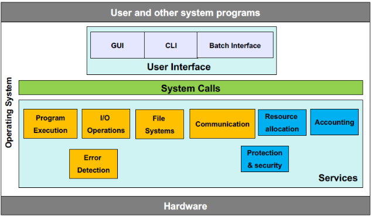
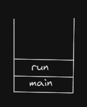
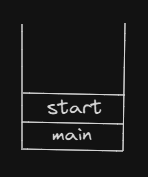
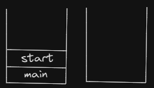
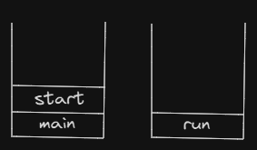
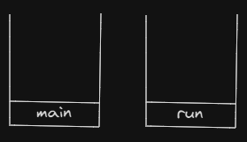

# 운영체제
## 2.1 운영체제 서비스



사용자에게 도움 주는 목적의 서비스는 아래와 같다

**user 인터페이스(UI)**
- GUI
- 터치 스크린 인터페이스
- 명령어 라인 인터페이스(CLI)

**프로그램 수행**<br>
시스템은 프로그램을 메모리에 적재해 실행할 수 있어야 하며, 실행을 끝낼 수 있어야 한다

**입출력 연산**
- 수행중인 프로그램은 입출력을 요구할 수 있다. 파일 혹은 입출력 장치가 연관된다
- 사용자들은 입출력 장치를 직접 제어할 수 없고, 운영체제가 입출력 수행의 수단을 제공해야 한다

**파일 시스템 조작**
- 프로그램은 파일을 읽고 쓸 필요가 있다
- 이름에 의해 파일을 생성하고 삭제하고 찾을 수 있어야 한다
- 파일 소유권 기반 권한 관리를 이용해 접근을 허가하거나 거부할 수 있다

**통신**
- 한 프로세스가 다른 프로세스와 정보를 교환해야 할 필요가 있다
- 동일 컴퓨터에서 수행되고 있는 프로세스들 사이 or 네트워크에 의해 묶여진 서로 다른 컴퓨터 시스템상에서 수행되는 프로세스들 사이에서 발생
- 구현: 공유 메모리 or 메시지 전달 기법
- 메시지 전달 기법은 정보의 패킷들이 운영체제 의해 프로세스들 사이를 이동

**오류 탐지**
- 운영체제는 모든 가능한 오류를 항상 의식해야 한다
- 오류는 CPU, 메모리 하드웨어, 입출력 장치, 사용자 프로그램에서 발생 가능
- 올바르고 일관성있는 계산을 보장하기 위해 각 유형의 오류에 대해 적당한 조처

시스템 자체의 효율적인 동작을 보장하는 목적의 서비스는 아래와 같다

**자원 할당**<br>
다수의 프로세스나 다수의 작업이 동시에 실행될 때 자원을 할당

**기록 작성**<br>
어떤 프로그램이 어떤 종류의 컴퓨터 자원을 얼마나 많이 사용하는지 추적

**보호 및 보안**

## 2.2 사용자와 운영체제 인터페이스
사용자가 운영체제와 접촉하는 방식

### 2.2.1 command interpreter (명령어 라인 인터페이스 (CLI))
- command interpreter(명령 인터프리터): 입력된 명령어를 읽고 실행하는 컴퓨터 프로그램
- shell: 명령 인터프리터를 제공하는 시스템의 해석기. 사용자 입력을 읽고 해석하고 처리결과를 뿌려주는 시스템 프로그램
- 명령 인터프리터는 사용자가 지정한 명령을 가져와 수행하고, 명령의 대부분은 파일을 조작
- 프로그래밍이 가능해 반복적으로 해야 하는 작업을 쉽게 할 수 있게 한다<br>
: 자주 사용되는 작업이 command-line의 절차를 필요로 하면, 이 절차를 파일로 저장하고, 이 파일을 프로그램 실행처럼 이용할 수 있다 (shell scripts) <br>
: 이런 프로그램은 실행 가능한 기계어로 컴파일되지는 않지만 CLI에 의해 번역되면서 실행된다

**명령어 구현방식 1. 명령 인터프리터 자체가 명령을 실행할 코드 가지는 경우**
- 명령을 명령 인터프리터가 자신의 코드로 분기하고 적절한 시스템 콜을 한다
- 제공될 수 있는 명령의 수가 명령 인터프리터 크기 결정
 
**명령어 구현방식 2. 시스템 프로그램에 의해 명령을 구현하는 경우**
- 명령 인터프리터는 명령을 전혀 알지 못한다
- 명령 인터프리터는 메모리에 적재되어 실행될 파일을 식별하기 위해 명령을 사용한다
- ex) `rm file.txt` <br>
: rm이라 불리는 파일 찾아서 메모리에 적재하고 그것을 매개변수 file.txt로 수행 <br>
: rm 명령과 관련된 로직은 rm이라는 파일 내의 코드로 정의
- 프로그래머는 적합한 프로그램 로직을 가진 새로운 파일을 생성함으로써 시스템에 새로운 명령 추가 가능

### 2.2.2 그래픽 기반 사용자 인터페이스 (GUI)
- 사용자 친화적
- 마우스 기반으로 메뉴 시스템 사용 
- 화면 아이콘 이용해 프로그램 호출하거나 파일 선택 등

### 2.2.3 터치스크린 인터페이스
- 모바일 시스템
- 손가락 이용한 제스처로 상호 작용


<br>
<br>
<br>
<br>

# Java
## 프로세스와 쓰레드
- 프로세스(공장): 실행중인 프로그램이며, 프로그램 수행에 필요한 데이터와 메모리 등의 자원과 쓰레드로 구성
- 쓰레드(일꾼): 프로세스의 자원을 이용해서 실제로 작업을 수행하는 것

모든 프로세스에는 최소 하나 이상 쓰레드 존재<br>
프로세스가 가질 수 있는 쓰레드 개수 제한x

- 멀티쓰레드 프로세스: 둘 이상의 쓰레드를 가진 프로세스

쓰레드는 개별 메모리 공간(call stack) 필요 -> 프로세스 메모리 한계에 따라 생성 가능한 쓰레드 수 결정됨

**멀티태스킹**
- 여러 프로세스가 동시 실행

**멀티쓰레딩**
- 하나의 프로세스 내에서 여러 쓰레드가 동시에 작업 수행
- CPU 코어가 한 번에 하나의 작업 수행 -> 실제로 동시에 처리되는 작업의 개수는 코어 개수와 동일
- 각 코어가 짧은 시간 동안 여러 작업 번갈아 수행해, 여러 작업들이 동시에 수행되는 것처럼 보이게 함
- 프로세스 성능이 단순히 쓰레드 개수에 비례하는 것은 아님

**멀티쓰레딩 장점**
- CPU 사용률 향상
- 자원 효율적 사용
- 사용자에 대한 응답성 향상
- 작업 분리되어 코드가 간결해짐

멀티쓰레드로 작성되어있기 때문에 메신저로 채팅하면서 파일 다운로드 받을 수 있다. 만약 싱글쓰레드로 작성되어 있다면 파일 다운로드 받는 동안 다른 일(채팅) 불가

하나의 서버 프로세스가 여러 개의 쓰레드를 생성해, 쓰레드와 사용자의 요청이 일대일로 처리되도록 프로그래밍 해야한다.  (서버 프로그램 멀티쓰레드로 작성) 싱글쓰레드로 작성하면, 사용자의 요청마다 새로운 프로세스 생성해야 한다<br>
프로세스 생성은 쓰레드 생성보다 시간과 메모리 공간이 더 많이 필요함

**멀티쓰레딩 단점**
여러 쓰레드가 같은 프로세스 내 자원 공유하면서 발생하는 문제
- 동기화
- 교착상태: 두 쓰레드가 자원 점유한 상태에서 서로 상대편이 점유한 자원 사용하려고 기다리느라 진행 멈춰있는 상태

## 쓰레드 구현과 실행
**쓰레드 구현 방법**
- `Thread` 클래스 상속받기
- `Runnable` 인터페이스 구현

인터페이스는 다중상속이 되기 때문에 Runnable 구현하는 방법이 일반적

두 방식 모두 쓰레드를 통해 작업하고자 하는 내용으로 run()의 몸통{}을 채운다

- 두 방식의 차이점: 인스턴스 생성 방법

Thread의 자손 클래스 인스턴스 생성 방법
```Java
ThreadEx1 t1 = new ThreadEx1();
```

Runnable 구현한 클래스 인스턴스 생성 방법
```Java
Runnable r = new ThreadEx2();
Thread t2 = new Thread(r); // Thread(Runnable target) 생성자 이용
```

- 두 방식의 차이점: Thread클래스의 메서드 호출방식<br>
+Thread 클래스 상속시, 조상인 Thread클래스의 메서드 직접 호출 가능<br>
+Runnable 구현시, Thread 클래스의 static메서드인 currentThread()를 호출해 실행중인 쓰레드에 대한 참조를 먼저 얻어야 함. `static Thread currentThread()`


쓰레드 이름은 생성자나 메서드 통해 지정 또는 변경 가능<br>
`Thread(Runnable target, String name)`<br>
`Thread(String name)`<br>
`void setName(String name)`


쓰레드 이름 지정하지 않으면 'Thraed-번호'형식으로 이름 자동 저장

### 쓰레드 실행-start()

쓰레드 생성했다고 자동 실행되는게 아니라, start() 호출해야 실행됨
`t1.start()`

start()호출됐다고 바로 실행되는게 아니라, 실행대기 상태에 있다가 차례가 되면 실행. 

한 번 실행이 종료된 쓰레드는 다시 실행할 수 없다<br>
하나의 쓰레드에 대해 start()는 한 번만 호출될 수 있다. 만약 두 번 이상 호출하면 `IllegalThreadStateException` 발생한다 <br>
쓰레드 작업 한 번 더 수행해야하면, 새로운 쓰레드 생성한 다음 start()호출하자
```Java
ThreadEx1 t1 = new ThreadEx1();
t1.start();
t1 = new ThreadEx1(); // 다시생성
t1.start(); // OK
```

## start()와 run()
쓰레드 실행시 왜 `run()`이 아니라 `start()`를 호출할까?<br>
만약 main메서드에서 `run()`을 호출하면, 생성된 쓰레드 실행시키는게 아니라 단순히 메서드 호출하는 것<br>


**start()**<br>
새로운 쓰레드는 call stack을 생성한 다음 run()을 호출해서, 생성된 call stack에 run()이 첫 번째로 올라간다<br>
모든 쓰레드는 독립적인 작업 수행을 위해 자신만의 call stack을 필요로 한다<br>
새로운 쓰레드 생성하고 실행시킬 때마다 새로운 call stack이 생성되고 쓰레드가 종료(run()수행 종료)되면 call stack비워지면서 소멸된다

<br>

**call stack 변화**<br>

 1. main메서드에서 쓰레드의 start()호출 <br>
 2. start()는 새로운 쓰레드 생성하고, 쓰레드가 사용할 call stack 생성 <br>
 3. 새로 생성된 call stack에 run()이 호출돼 쓰레드가 독립된 공간에서 작업<br>
 4. start() 메서드는 새로운 스레드를 생성한 후 더 이상 작업이 없으므로 실행이 종료되며, call stack이 2개이므로 스케줄러가 정한 순서에 의해 실행 <br>

- 호출스택에서 가장 위에 있는 메서드가 현재 실행중인 메서드이고, 나머지 메서드들은 대기상태에 있다

스케줄러는 쓰레드들의 우선순위 고려해 실행순서와 실행시간 결정

### main쓰레드
main메서드 작업을 수행하는 것도 쓰레드

프로그램 실행하면 기본적으로 하나의 쓰레드를 생성하고, 그 쓰레드가 main메서드를 호출해 작업이 수행되는 것

보통 main메서드가 종료되면 해당 call stack이 비워지면서 프로그램이 종료되는데, main 메서드가 수행을 마쳤더라도 다른 쓰레드가 작업을 마치지 않은 상태이면 프로그램이 종료되지 않는다.

한 쓰레드가 예외가 발생해 종료되어도 다른 쓰레드의 실행에는 영향을 미치지 않는다

- 실행중인 사용자 쓰레드가 하나도 없을 때 프로그램 종료됨
- 쓰레드 종류: 사용자 쓰레드 + 데몬 쓰레드
<br><br>
- `printStackTrace()`: call stack 출력