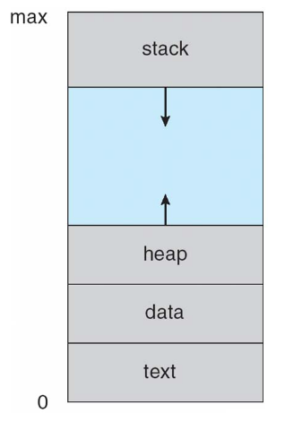
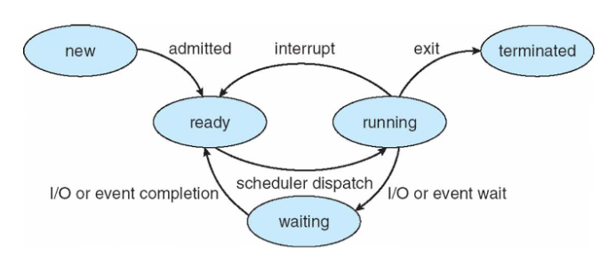
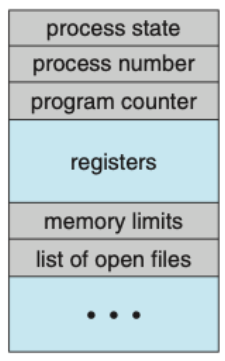

# 운영체제
## 프로세스
초창기 컴퓨터는 작업(job) 실행하는 일괄처리 시스템 -> 이후 task 실행하는 시분할 시스템 -> 여러 프로그램을 한 번에 실행할 수 있는 단일 사용자 시스템  
+임베디드 장치같이 한 번에 하나의 프로그램만 실행할 수 있더라도 운영체제는 메모리 관리같은 자체 프로그램된 내부 활동 지원

이런 모든 활동이 프로세스

### 프로세스
실행중인 프로그램

**프로세스 메모리 배치**
- 여러 섹션으로 구분
- 각 프로세스별로 독립적으로 텍스트, 데이터, 힙, 스택 메모리를 가진다  
-> 프로세스간 메모리 충돌 x

- 텍스트 섹션: 실행코드 (크기 고정)
- 데이터 섹션: 전역 변수 (크기 고정)
- 힙 섹션: 동적으로 할당되는 메모리 (크기 동적)
- 스택 섹션: 함수 호출시 임시 데이터 저장 장소 : 함수 매개변수, 복귀 주소, 지역 변수 포함하는 '활성화 레코드'가 스택에 push되고, 함수에서 제어 되돌아오면 스택에서 활성화 레코드가 pop됨 (크기 동적)

프로그램 자체는 프로세스가 아니다
- 프로그램: 명령어 리스트를 가진 디스크에 저장된 실행 파일로, 수동적 존재
- 프로세스: 프로그램 카운터(다음 실행할 명령어 지정)와 자원을 가진 능동적 존재

실행 파일이 메모리에 적재될 때 프로그램은 프로세스가 된다

프로세스 자체가 다른 개체를 위한 실행 환경으로 동작할 수 있다 
ex) Java프로그램은 JVM안에서 실행된다. JVM은 Java코드를 해석하고, 그 코드 대신 원 기계어를 이용해 행동하는 프로세스로서 프로그램 실행 (컴파일된 파일을 실행하는 `java` 명령어는 JVM을 프로세스처럼 실행시킴)

### 프로세스 상태
- new: 프로세스 생성 중
- running: 명령어 실행 중
- waiting: 이벤트(입출력 완료 또는 신호 수신) 발생 기다림
- ready: 프로세스가 처리기에 할당되기를 기다림
- terminated: 프로세스 종료

어느 한 순간에 한 처리기 코어에서는 오직 하나의 프로세스만이 실행된다 
많은 프로세스가 준비완료 및 대기 상태에 있을 수 있다

### 프로세스 제어 블록
- 프로세스 제어 블록 = PCB = 태스크 제어 블록
- 프로세스는 운영체제에서 PCB에 의해 표현됨
- 각 프로세스마다 독립적으로 하나씩 존재
- 특정 프로세스와 연관된 여러 정보 수록

**PCB에 포함된 정보**

- 프로세스 상태
- 프로그램 카운터: 이 프로세스가 다음에 실행할 명령어 주소
- CPU 레지스터 
- CPU 스케줄링 정보: 프로세스 우선순위, 스케줄 큐의 포인터 등
- 메모리 관리 정보
- 회계 정보: CPU 사용시간, 시간 제한, 프로세스 번호 등
- 입출력 상태 정보: 이 프로세스에 할당된 입출력 장치와 열린 파일의 목록 등

PCB: 회계 정보와 함께 프로세스 시작시키거나 다시 시작시키는데 필요한 모든 데이터를 위한 저장소

### 스레드
- 단일 제어 스레드는 프로세스가 한 번에 한 가지 일만 실행가능
- 현대에는 한 프로세스가 한 번에 하나 이상의 일을 수행할 수 있게 하기 위해 다수의 실행 스레드를 가질 수 있다 (스레드 병렬 실행)  
-> ex) 다중 스레드 워드 프로세서: 하나의 스레드에 사용자 입력 관리 맡기는 동안 다른 스레드가 철자 검사기 수행

PCB에 스레드 정보 포함