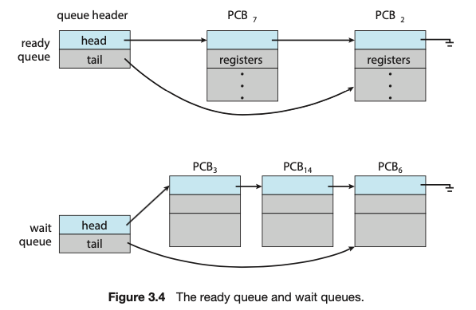
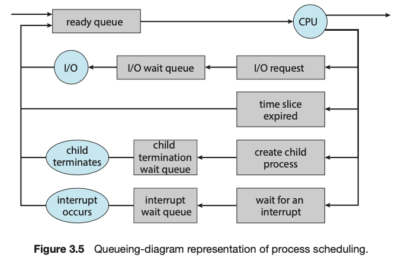

# 운영체제
## 프로세스 스케줄링
- 다중 프로그래밍의 목적: CPU 이용 최대화하기 위해 항상 어떤 프로세스가 실행되도록 하는 것
- 시분할 목적: 프로그램 실행되는 동안 사용자가 상호 작용 할 수 있게 프로세스들 사이에서 CPU 코어 빈번하게 교체하는 것

이 목적을 위해 **프로세스 스케줄러**는 실행 가능한 여러 프로세스 중 하나 선택

- 다중 프로그래밍 정도: 현재 메모리에 있는 프로세스 수
- I/O 바운드 프로세스: 계산보다 I/O에 더 많은 시간을 소비하는 프로세스
- CPU 바운드 프로세스: 계산에 더 많은 시간을 써서 I/O요청 자주 생성하지 않음

### 스케줄링 큐

- 연결 리스트로 저장
- 헤더에는 리스트의 첫 번째 PCB에 대한 포인터 저장, 각 PCB에는 준비 큐의 다음 PCB를 가리키는 포인터 필드 있음

**준비 큐**
- 프로세스가 시스템에 들어가면 준비 큐에서 준비 상태가 되어 디스패치 될 때까지 기다림

**대기 큐**
- 프로세스에 CPU 코어 할당되면 실행되다가 I/O 완료 같은 이벤트가 발생할 때까지 기다리는 프로세스는 대기 큐에 삽입

**큐잉 다이어그램**

- 원: 큐에 서비스 제공하는 자원
- 화살표: 프로세스 흐름
- 프로세스가 I/O 요청한 후 I/O대기 큐에 놓임
- 프로세스는 새 자식 프로세스를 만든 후 자식 종료를 기다리는 동안 대기 큐에 놓임
- 인터럽트 발생을 기다리는 동안 대기 큐에 놓임
- 타임이 만료되어 프로세스가 코어에서 강제로 제거된 후 준비 큐로 돌아감

### CPU 스케줄링
- CPU 스케줄러의 역할: 준비 큐에 있는 프로세스 중 선택된 하나의 프로세스에 CPU 코어 할당 
-> 새 프로세스를 자주 선택해야 함

**스와핑**
- 메모리(CPU에 대한 경쟁)에서 프로세스를 제거해 다중 프로그래밍 정도를 감소시키는 것이 유리할 수 있다는 아이디어
- 나중에 프로세스를 메모리에 다시 적재할 수 있으며 중단된 위치에서 계속 실행할 수 있다
- 스왑아웃: 프로세스를 메모리에서 디스크로 
- 스왑인: 디스크에서 메모리로 복원
- 메모리가 초과 사용되어 가용공간 확보해야 할 때 필요

### Context Switch
인터럽트는 운영체제가 CPU 코어를 현재 작업에서 뺏어 커널 루틴 실행할 수 있게 하는데, 인터럽트 처리 끝난 후 문맥을 복구할 수 있도록 현재 실행 중인 프로세스의 문맥 저장할 필요가 있다

**Context** 
- 프로세스의 PCB에 표현
- CPU 레지스터 값, 프로세스 상태, 메모리 관리 정보 등 포함

**Context Switch** 
- CPU 코어를 다른 프로세스로 교환하기 위해, 이전 프로세스 상태 보관하고 새로운 프로세스의 보관된 상태를 복구하는 작업
- 과거 프로세스의 문맥을 PCB에 저장하고, 실행이 스케줄 된 새로운 프로세스의 저장된 문맥을 복구 
- 문맥 교환 시간은 오버헤드: 진행되는 동안 시스템은 아무 일 못함