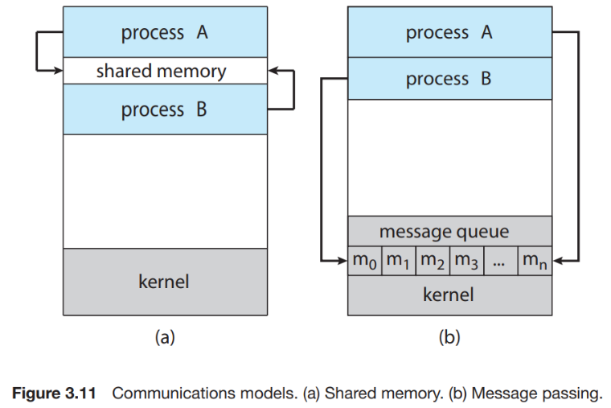

# 운영체제
## 프로세스 간 통신 IPC
운영체제 내의 병행 프로세스들은 독립적이거나 협력적
- 독립적: 다른 프로세스들과 데이터 공유 x
- 협력적: 다른 프로세스들에 영향 주고받음

프로세스 협력 허용 이유
- 정보 공유
- 계산 가속화: 특정 태스크 빨리 실행하기 위해 서브 태스크로 나누어 병렬로 실행되게 해야 하는데, 복수 개의 처리 코어를 가진 경우에만 가능
- 모듈성: 시스템 기능을 별도의 프로세스들 또는 스레드들로 나누어 모듈식 형태로 시스템 구성

**협력적 프로세스들의 데이터 교환을 위한, IPC 기법**
- 공유 메모리: 공유되는 메모리 영역 구축
- 메시지 전달: 시스템 콜 사용해 구현 -> 커널 간섭 등의 부가적인 시간 소비 작업 필요해서 공유 메모리 모델보다 느리다. 구축할 때만 시스템 콜 필요하고, 접근은 일반 메모리 접근으로 취급되어 커널 도움 필요없다 



## 공유 메모리 시스템에서의 프로세스 간 통신
- 통신하는 프로세스들이 공유 메모리 영역 구축해야 함
- 공유 메모리 영역은 이를 생성하는 프로세스의 주소 공간에 위치
- 일반적으로 운영체제는 한 프로세스가 다른 프로세스의 메모리에 접근하는 것을 금지함. 공유 메모리는 둘 이상의 프로세스가 이 제약 제거에 동의해야 함
- 데이터 형식과 위치는 프로세스가 결정
- 프로세스들은 동시에 동일한 위치에 쓰지 않도록 책임져야 함

생산자-소비자 문제
- 주요 문제: 버퍼 부족 문제, 버퍼 초과 문제
- 생산자 프로세스는 정보를 생산, 소비자 프로세스는 정보를 소비
- 생산자와 소비자 프로세스들이 병행으로 실행되기 위한 버퍼가 공유 메모리 영역에 존재<br>
: 생산자가 한 항목 생산하고, 그 동안 소비자는 다른 항목 소비 가능<br>
: 생산자와 소비자는 동기화되어야 한다. (없는 항목을 소비자가 소비하려 시도하지 않게하기 위해)<br>
: 공유 메모리에 버퍼를 만들어 사용하는게 해결책 중 하나

**버퍼 유형**
- 무한 버퍼: 버퍼 크기에 한계x, 생산자는 항상 새로운 항목 생산 가능
- 유한 버퍼: 버퍼 크기 고정, 버퍼 비어있으면 소비자가 대기하고 버퍼가 가득 차면 생산자가 대기

**공유 버퍼**<br>
(공유 메모리에 다음 변수가 있다고 가정)
```C
#define BUFFER_SIZE 10

typedef struct {
    ...
} item;

item buffer[BUFFER_SIZE];
int in = 0;
int out = 0;
```
- 공유 버퍼는 두 개의 논리 포인터 in, out을 갖는 원형 배열로 구현
- 변수 `in`: 버퍼 내 다음으로 비어있는 위치
- 변수 `out`: 버퍼 내 첫 번째로 채워져 있는 위치

(예시 코드는 동기화 처리 안된 코드)<Br><Br>
**공유 메모리 사용한 생산자 프로세스**
```C
item next_produced;

while (true) {
    /* next_produced에 아이템 생산 */
    
    while ((in + 1) % BUFFER_SIZE) == out) {
    	; /* 아무 것도 안 함 */
    }
    
    buffer[in] = next_produced;
    in = (in + 1) % BUFFER_SIZE;
}
```
- `((in+1)%BUFFER_SIZE) == out`: 버퍼 가득참

**공유 메모리 사용한 소비자 프로세스**
```C
item next_consumed;

while (true) {
    while (in == out) {
    	; /* 아무 것도 안 함 */
    }
    
    next_consumed = buffer[out];
    out = (out + 1) % BUFFER_SIZE;
    
    /* next_consumed에 있는 아이템을 소비 */
}
```
- `in == out`: 버퍼 비어있음

이 방법은 최대 BUFFER_SIZE-1까지만 버퍼에 수용 가능.

**버퍼에 BUFFER_SIZE개 까지 넣을 수 있도록 코드 수정**<br>
버퍼에 몇 개의 아이템이 있는지 추적하기 위해, 초기값이 0인 카운터 변수(count) 추가

- 생산자 코드
```C
item next_produced;

while (true) {
    /* next_produced에 아이템 생산 */
    
    while (count == BUFFER_SIZE) {
        ; /* 아무 것도 안 함 (버퍼가 가득 참) */
    }
    
    buffer[in] = next_produced;         // 버퍼에 아이템 추가
    in = (in + 1) % BUFFER_SIZE;        // 원형 버퍼 처리
    count++;                            // 아이템 개수 증가
}
```

- 소비자 코드
```C
item next_consumed;

while (true) {
    while (count == 0) {
        ; /* 아무 것도 안 함 (버퍼가 비어 있음) */
    }
    
    next_consumed = buffer[out];        // 버퍼에서 아이템 가져오기
    out = (out + 1) % BUFFER_SIZE;      // 원형 버퍼 처리
    count--;                            // 아이템 개수 감소

    /* next_consumed에 있는 아이템을 소비 */
}
```

## 메시지 전달 시스템에서의 프로세스 간 통신
- 운영체제가 메시지 전달 설비 통해 프로세스 간 통신 수단 제공
- 프로세스 동작을 동기화하는 기법 제공
- 분산 환경에서 특히 유용 
- 연산: `send(message)` , `receive(message)`
- 메시지는 고정 길이 or 가변 길이
- 통신을 위해 우선 communication link가 설정되어야 함

**링크, send(), receive() 연산의 논리적 구현 방법**
- 직접 또는 간접 통신
- 동기식 또는 비동기식 통신
- 자동 또는 명시적 버퍼링

### 1. 명명 (직접 or 간접)
통신 원하는 프로세스들은 서로를 가리킬 방법이 있어야 한다

**직접 통신**<br> 
수신자 또는 송신자 이름 명시
- `send(P, message)`: 프로세스 P에 메시지 전송
- `receive(Q, message)`: 프로세스 Q로부터 메시지 수신

**직접 통신의 특징**
- 연결 자동 구축 
- 통신위해 상대방 신원만 알면 된다
- 연결은 두 프로세스 사이에만 연관
- 통신 프로세스 사이에는 하나의 연결이 존재
- 대칭성: 송신자와 수신자 모두가 상대방 이름 제시
- 프로세스를 지정하는 방식이라 모듈성 제한: 프로세스 이름 바꾸면 참조된 부분을 다 찾아서 변경해야 하는 하드코딩

**간접 통신**<br>
메시지들은 메일박스 또는 포트로 송신되고 수신

- 메일박스: 추상적으로 프로세스들에 의해 메시지들이 넣어지거나 제거될 수 있는 개체며, 고유 id 가짐
- 두 프로세스들이 공유 메일박스 가질 때만 이들 프로세스가 통신 가능
- `send(A, message)`: 메시지를 메일박스 A로 송신
- `receive(A, message)`: 메시지를 메일박스 A로부터 수신

**메일박스 특징**
- 연결은 프로세스가 공유 메일박스 가질 때만 구축
- 연결은 두 개 이상의 프로세스들과 연관될 수 있다
- 통신하는 각 프로세스 사이에는 다수의 서로 다른 연결이 존재할 수 있고, 각 연결은 하나의 메일박스에 대응
<br><br>
- 메일박스는 한 프로세스 또는 운영체제에 의해 소유될 수 있다
- 메일박스가 프로세스에 소유되면 (프로세스의 주소 공간의 일부), 소유자(수신만 가능한 프로세스)와 사용자(송신만 가능한 프로세스) 구분 가능
- 메일박스 소유하는 프로세스가 종료할 때 메일 박스는 사라지며, 그 후 이 메일박스로 메시지 송신하는 모든 프로세스는 삭제 사실을 반드시 통보받아야 한다
- 새로운 메일 박스를 생성하는 프로세스는 해당 메일박스의 소유자가 된다. 초기에는 유일하게 메시지 수신할 수 있지만, 소유권과 수신 특권은 시스템 콜을 통해 다른 프로세스에 전달될 수 있다. 따라서 복수의 수신자를 낳을 수 있다
- 운영체제가 소유한 메일박스는 자체적으로 존재하며, 특정 프로세스에 속하지 않는다 

### 2. 동기화
메시지 전달은 동기식(blocking)이거나 비동기식(nonblocking) 방법으로 전달

- blocking send: 송신 프로세스는 메시지가 제대로 전송될 때까지(수신 프로세스 또는 메일박스에 수신될 때까지) 다른 작업을 하지 못하고 대기
- nonblocking send: 송신 프로세스가 메시지를 전송한 후, 메시지가 수신 프로세스나 메일박스에 도달했는지 여부에 관계없이 바로 다음 작업을 수행
- blocking receive: 수신 프로세스가 메시지를 수신하려 할 때, 메시지가 도착하지 않으면 메시지를 받을 때까지 아무 작업 수행할 수 없고 대기
- nonblocking receive: 수신 프로세스가 메시지를 수신하려 할 때, 메시지가 도착하지 않으면 유효한 메시지나 NULL 즉시 반환

send()랑 receive() 둘 다 동기식일 때, 수신자와 송신자 간 랑데부(randezvous)를 한다. 즉, 서로 작업이 완료될 때까지 기다렸다가 동기화

**랑데부의 동작 원리**
1. 송신 프로세스는 메시지를 전송하려고 하지만, 수신 프로세스가 준비될 때까지 대기
2. 수신 프로세스는 메시지를 받으려고 하지만, 송신 프로세스가 준비될 때까지 대기
3. 두 프로세스가 모두 준비되었을 때, 메시지가 송신 프로세스에서 수신 프로세스로 전달되며, 두 프로세스는 대기 상태를 종료하고 다음 작업을 수행

**랑데부의 특징**
- 동기화 보장<br>
: 송신과 수신이 동시에 발생하므로 메시지가 반드시 전송 및 수신<br>
: 통신 실패나 메시지 손실이 발생하지 않는다

### 3. 버퍼링
- 통신 프로세스 간 메시지 전달을 위해 중간에 데이터를 임시로 저장하는 메커니즘
- 송신자와 수신자가 완전히 동시에 실행되지 않더라도 데이터를 안전하게 전달할 수 있도록 설계된 기능이다. 즉, 메시지를 임시로 저장할 수 있는 큐를 사용해, 통신 프로세스 간의 실행 타이밍 차이를 조정

**임시 큐 구현 방식**
- 무용량<br>
: 큐의 길이 0으로, 메시지 가질 수 없다<br>
: 송신자는 수신자가 메시지 수신할 때까지 기다려야 한다<br>
: 버퍼가 없는 메시지 시스템
- 유한 용량<br>
: 큐는 유한한 길이 N을 가지며, 최대 N개의 메시지가 있을 수 있다<br>
: 새로운 메시지 전송시 큐가 만원이 아니면, 메시지는 큐에 놓이며 송신자는 대기하지않고 실행 계속함<br>
: 새로운 메시지 전송시 큐가 만원이면, 송신자는 큐 안에 공간 이용 가능할 때까지 blocking<br>
: 자동 버퍼링
- 무한 용량<br>
: 큐의 길이 무한이라 메시지들이 얼마든지 큐 안에 대기 가능<br>
: 송신자는 절대 blocking되지 않음<br>
: 자동 버퍼링