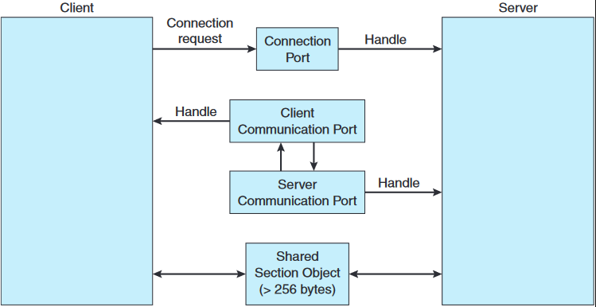
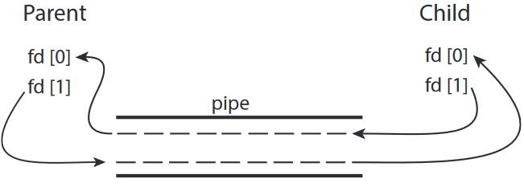

# 운영체제
## IPC 시스템의 사례
### POSIX 공유 메모리
POSIX 공유 메모리는 메모리에 매핑된 파일, 즉 공유 메모리 특정 영역을 파일과 연관시켜 구현함 

- 공유 메모리 구현에 생산자-소비자 모델 사용<br>
- 생산자: 공유 메모리 객체 구축하고 공유 메모리에 데이터를 쓴다<br>
- 소비자: 공유 메모리에서 데이터를 읽는다

**POSIX 공유 메모리 API를 설명하는 생산자 프로세스**
```C
#include <stdio.h>
#include <stdlib.h>
#include <string.h>
#include <fcntl.h>
#include <sys/shm.h>
#include <sys/stat.h>
#include <sys/mman.h>

int main()
{
    /* 공유 메모리 개체의 크기 (바이트 단위) */
    const int SIZE = 4096;
    /* 공유 메모리 개체의 이름 */
    const char *name = "OS";
    /* 공유 메모리에 쓸 문자열 */
    const char* message_0 = "Hello";
    const char* message_1 = "World!";
    
    /* 공유 메모리 파일 설명자 */
    int fd;
    /* 공유 메모리 개체를 가리키는 포인터 */
    char *ptr;
    
    /* 공유 메모리 개체 생성 */
    fd = shm_open(name,O CREAT | O RDWR,0666);
    
    /* 공유 메모리 개체의 크기를 바이트 단위로 설정 */
    ftruncate(fd, SIZE);
    
    /* 공유 메모리 개체를 메모리에 매핑 */
    ptr = (char*) mmap(0, SIZE, PROT READ | PROT WRITE, MAP SHARED, fd, 0);
    
    /* 공유 메모리 개체에 쓰기 */
    sprintf(ptr,"%s",message 0);
    ptr += strlen(message 0);
    sprintf(ptr,"%s",message 1);
    ptr += strlen(message 1);
    
    return 0;
}
```
- 프로세스가 `shm_open()` 시스템 콜로 공유 메모리 객체 생성하고, 성공적으로 생성되면 공유 메모리 객체를 나타내는 정수형 파일 설명자를 반환 <br>
- `mmap()`: 공유 메모리 객체를 포함하는 메모리에 매핑된 파일을 구축하고, 해당 포인터 반환
- `sprintf()` 함수를 호출해 출력 형식이 완성된 문자열을 ptr가 가리키는 공유 메모리 객체에 쓰고, 쓰기 작업 성공시 쓰인 바이트 수만큼 포인터 증가시킴

**POSIX 공유 메모리 API를 설명하는 소비자 프로세스**
```C
#include <stdio.h>
#include <stdlib.h>
#include <fcntl.h>
#include <sys/shm.h>
#include <sys/stat.h>
#include <sys/mman.h>

int main()
{
    /* 공유 메모리 개체의 크기 (바이트 단위) */
    const int SIZE = 4096;
    /* 공유 메모리 개체의 이름 */
    const char* name = "OS";
    /* 공유 메모리 파일 설명자 */
    int fd;
    /* 공유 메모리 개체를 가리키는 포인터 */
    char* ptr;
    
    /* 공유 메모리 개체 열기 */
    fd = shm_open(name, O RDONLY, 0666);
    
    /* 공유 메모리 개체 메모리에 매핑 */
    ptr = (char*) mmap(0, SIZE, PROT READ | PROT WRITE, MAP SHARED, fd, 0);
    
    /* 공유 메모리 개체로부터 읽기 */
    printf("%s",(char *)ptr);
    
    /* 소비자 프로세스는 접근이 끝난 공유 메모리 제거 */
    shm_unlink(name);
    
    return 0;
}
```

### Mach 메시지 전달
- Mach에서 통신은 포트라고 하는 메일박스로 메시지를 주고받으며 통신<br>
: 포트는 크기가 정해져 있고 단방향
- 양방향 통신은 메시지가 한 포트로 전송되고 응답이 별도의 응답 포트로 전송
- 각 포트에는 여러 송신자가 있을 수 있지만 수신자는 오직 하나
- 동일한 호스트 또는 분산 시스템의 별도 호스트의 두 포트에서 메시지 전달 가능
- 각 포트에는 그 포트와 상호작용하는데 필요한 자격을 식별하는 포트 권한 집합 있음<br>
: 각 포트 권한은 해당 포트의 이름(포트 이름은 정수 값)을 기반으로 관리
- 포트를 생성한 태스크가 해당 포트의 소유자고, 소유자는 해당 포트에서 유일하게 메시지 수신할 수 있다
- 소유자는 포트 자격을 조작할 수 있어서 응답 포트를 설정할 수 있다
- 동일한 태스크에 속하는 모든 스레드가 동일한 포트 권한을 공유
- 태스크가 생성되면 두 개의 특수 포트인 Task Self 포트와 Notify 포트 생성
- 커널은 Task Self 포트에 대한 수신 권한이 있어 태스크가 커널에 메시지를 보낼 수 있다
- 커널은 이벤트 발생 알림을 Notify 포트로 보낼 수 있다

**포트 생성 코드**
```C
mach_port_t my_port; // 포트 이름을 저장할 변수 (정수 값)

mach_port_allocate(mach_task_self(),
    MACH_PORT_RIGHT_RECEIVE,
    &my_port); // 새 포트 생성
```
- `mach_port_allocate()`: 새 포트를 작성하고 메시지 큐를 위한 공간 할당하며, 포트에 대한 권한 식별
<br><br>
- 각 태스크는 부트스트랩 포트에 액세스 할 수 있어서 태스크가 생성한 포트를 시스템 전체의 부트스트랩 서버에 등록할 수 있다
- 포트가 부트스트랩 서버에 등록되면 다른 태스크가 이 레지스트리에서 포트를 검색해 포트로 메시지를 보낼 수 있는 권한을 얻을 수 있다
- 각 포트와 관련된 큐 크기는 제한되어 있고, 처음에는 비어있다
- 메시지가 포트로 전송되면 큐에 복사되며, 모든 메시지는 동일한 우선순위를 가지기 때문에 동일 송신자의 여러 메시지가 큐에 삽입될 때 절대적 순서를 보장하지 않는다

**Mach 메시지 필드**
- 헤더: 메타데이터 포함, 고정크기 
- 본체: 데이터 포함, 가변 크기
<br><br>
- 간단한 메시지는 데이터를 복사하고 패키징하고, 복잡한 메시지는 Out-of-line 데이터 포인터를 활용
- Out-of-line 데이터 전송에는 데이터가 저장된 메모리 위치를 가리키는 포인터만 필요

**메시지 주고받기**<br>
`mach_msg()`: 메시지 보내고 받는 표준 API (송신인지 수신인지는 매개변수로 표현)
1. `mach_msg()` 호출
2. `mach_msg()`는 커널에 대한 시스템 콜인 `mach_msg_trap()`을 호출
3. `mach_msg_trap()`은 커널 내에서 `mach_msg_overwrite_trap()` 호출해 실제 메시지 전달 처리

메시지가 포트로 전송되었을 때 큐에 공간이 있으면 메시지가 큐에 복사되고 전송 작업이 계속 되며, 큐에 공간이 없으면 아래와 같다

**포트의 큐가 가득 찬 경우**<br>
네 가지 중 하나를 선택
1. 무기한 기다림
2. 최대 n 밀리초동안 기다림
3. 즉시 복귀
4. 메시지를 일시적으로 캐시<br>
: 서버 태스크를 위한 것. 서버는 요청 완료 후 클라이언트에 일회성 응답 보내야 하는데, 클라이언트 응답 포트가 가득 찬 경우에도 다른 요청받은 서비스를 계속 해야함
<br><br>
- 메시지 시스템의 문제점: 송신자 포트에서 수신자 포트로 메시지 복사 -> 성능저하 발생
- Mach 메시지 시스템은 복사 연산 피하고, 송신자 메시지가 포함된 주소 공간을 수신자의 주소 공간에 매핑<br>
: 송신자와 수신자는 동일한 메모리에 액세스 -> 성능 향상 but 같은 시스템 내 메시지에만 작동

**Mach에서 메시지 전달 설명하는 예제**
```C
#include<mach/mach.h>

struct message {
    mach_msg_header_t header;
    int data;
};

mach_port_t client;
mach_port_t server;

    /* 클라이언트 코드 */

struct message message;

// 헤더 설정
message.header.msgh_size = sizeof(message);
message.header.msgh_remote_port = server;
message.header.msgh_local_port = client;

// 메시지 송신
mach_msg(&message.header, // 메시지 헤더
    MACH_SEND_MSG, // 메시지 송신
    sizeof(message), // 송신한 메시지 크기
    0, // 수신한 메시지의 최대 크기 - 필요없음
    MACH_PORT_NULL, // 수신 포트의 이름 - 필요없음
    MACH_MSG_TIMEOUT_NONE, // 타임 아웃 없음
    MACH_PORT_NULL // 노티 포트 없음
);

    /* 서버 코드 */

struct message message;

// 메시지 수신
mach_msg(&message.header, // 메시지 헤더
    MACH_RCV_MSG, // 메시지 송신
    0, // 송신한 메시지 크기
    sizeof(message), // 수신 받은 메시지 크기
    server, // 수신 포트 이름
    MACH_MSG_TIMEOUT_NONE, // 타임 아웃 없음
    MACH_PORT_NULL // 노티 포트 없음
);
```

### Windows 
서브시스템을 지원하며, 응용 프로그램은 메시지 전달 기법 통해 이들과 통신 (응용프로그램은 서브시스템 서버의 클라이언트로 간주)

**고급 로컬 프로시저 호출 설비(ALPC)**
- Windows의 메시지 전달 설비<br>
- 동일 기계상에 있는 두 프로세스간 통신에 사용

**포트**
- 두 프로세스 간 연결을 구축하고 유지하기 위해 포트 객체 사용
- 유형: 연결 포트, 통신 포트
- 서버 프로세스는 모든 프로세스가 접근 가능한 연결 포트 객체 제공
- 클라이언트가 서브시스템의 서비스 원할 때, 서버의 연결 포트 객체에 대한 핸들 열고 연결 요청 보냄
- 서버는 채널 생성하고 핸들을 클라이언트에게 반환
- 채널은 한 쌍의 사적인 통신 포트로 구성<br>
: 클라이언트에서 서버로 메시지 보내는 포트, 서버에서 클라이언트로 메시지 보내는 포트 

통신 채널은 클라이언트와 서버가 응답 메시지 기다리고있는 동안에도 다른 요청 받을 수 있도록 콜백 기법 제공


**ALPC 채널의 메시지 전달 기법 3가지**
1. 256바이트까지 작은 메시지: 포트의 메시지 큐가 중간 저장소로 사용되고 메시지는 프로세스에서 프로세스로 복사
2. 대용량 메시지: section object(채널과 연관된 공유 메모리 영역)로 전달 -> 데이터 복사 발생 x
3. 데이터 양이 많아 섹션 객체에 저장될 수 없는 경우: 서버 프로세스가 클라이언트 주소 공간을 직접 읽거나 쓸 수 있는 API 사용

- 클라이언트는 채널 설정 시 대용량 메시지 전송 필요 여부 결정
- 클라이언트가 대용량 메시지 보낸다고 결정할 경우, 섹션 객체 생성 요청
- 서버의 응답 메시지가 대용량이라 예상되면 서버가 섹션 객체 생성

Windows의 ALPC는 Windows API 부분이 아니라서 응용 프로그래머는 사용할 수 없다<br>
Windows API 사용하는 응용은 표준 원격 프로시저 호출을 부르며, RPC는 간접적으로 ALPC 호출을 통해 처리됨 <br>
많은 커널 서비스가 클라이언트 프로세스와 통신 위해 ALPC 사용

### 파이프
두 프로세스가 통신할 수 있게 하는 전달자

**통신시 제약으로, 파이프 구현시 고려해야 하는 4가지 문제**
1. 파이프가 단방향 통신 또는 양방향 통신을 허용하나?
2. 양방향 통신이 허용되면, 반이중 방식인가 전이중 방식인가?
3. 두 프로세스 간 특정 관계가 있어야 하나? (ex. 부모-자식)
4. 파이프는 네트워크 통해 통신이 가능한가, 아니면 동일 기계 안에 존재하는 두 프로세스끼리만 통신 가능한가?

- 파이프 유형: 일반 파이프, 지명 파이프

**1. 일반 파이프**
- 생산자-소비자 형태로 두 프로세스 간 통신 허용
- 생산자: 파이프의 한 종단(쓰기 종단)에 쓰고, 소비자는 다른 종단(읽기 종단)에서 읽음<br>
: 즉 한쪽으로만 데이터 전송가능하며 단방향 통신만 가능
- 양방향 통신이 필요할 경우 두 개의 파이프 사용
- 프로세스들이 서로 통신하는 동안에만 존재 

**1-1. UNIX 시스템의 일반 파이프**
- UNIX는 파이프를 파일의 특수 유형으로 취급<br>
-> 파이프는 read(), write() 시스템 콜 사용해 접근 가능
- 통신하는 두 프로세스는 부모-자식 관계를 가져야 한다<br>
: 동일한 기계상의 두 프로세스끼리만 통신 가능 
- 파이프를 생성한 프로세스 이외에는 접근 불가<br>
: 부모 프로세스가 파이프를 생성하고 `fork()`로 생성한 자식 프로세스와 통신하기 위해 사용 (자식 프로세스는 열린 파일을 부모로부터 상속받음)
- 파이프는 파일의 특수한 유형이기 때문에 자식 프로세스는 부모로부터 파이프를 상속받음<br>
: 부모가 파이프의 쓰기 종단(fd[1])에 데이터 쓰면, 파이프의 읽기 종단(fd[0])에서 자식이 읽을 수 있음<br><br>



**파이프와 파일 디스크립터**
1. `pipe(int fd[])`: fd[] 파일 설명자 통해 접근할 수 있는 일반 파이프 하고, 두 개의 파일 디스크립터를 반환<br>
-> fd[0]: 파이프의 읽기 종단<br>
-> fd[1]: 파이프의 쓰기 종단

2. 이 파이프는 부모와 자식 프로세스가 각자의 독립된 파일 디스크립터 복사본을 공유<br>
: fork() 호출 이후, 부모와 자식은 동일한 파이프를 참조하지만 서로 별개의 파일 디스크립터 복사본을 가지고 있음 <br>

```C
#include <sys/types.h>
#include <stdio.h>
#include <string.h>
#include <unistd.h>

#define BUFFER_SIZE 25
#define READ_END 0
#define WRITE_END 1

int main(void)
{
    char write_msg[BUFFER_SIZE] = "Greetings";
    char read_msg[BUFFER_SIZE];
    int fd[2];
    pid_t pid;
    
    /* 파이프 생성 */
    if (pipe(fd) == -1) {
    	fprintf(stderr,"Pipe failed");
        return 1;
    }
    
    /* 자식 프로세스 fork */
    pid = fork();
    if (pid <0) {/* 오류 발생 */
    	fprintf(stderr, "Fork Failed");
    	return 1;
    }
    
    if (pid >0) {/* 부모 프로세스 */
    	/* 사용하지 않는 파이프의 끝 부분 닫기 */
    	close(fd[READ END]);
    	/* 파이프에 쓰기 */
    	write(fd[WRITE_END], write_msg, strlen(write_msg)+1);
    	/* 파이프 쓰기 쪽 끝부분 닫기 */
    	close(fd[WRITE_END]);
    } else {/* 자식 프로세스 */
    	/* 사용하지 않는 파이프의 끝 부분 닫기 */
    	close(fd[WRITE_END]);
    	/* 파이프 읽기 */
    	read(fd[READ_END], read_msg, BUFFER_SIZE);
    	printf("read %s",read_msg);
    	/* 파이프 읽는 쪽 끝부분 닫기 */
    	close(fd[READ_END]);
    }
    
    return 0;
}
```
- 파이프 자체: 커널에 의해 관리되며, 물리적으로 존재하는 하나의 데이터 통로
- 파일 디스크립터: 프로세스가 커널의 자원을 참조하는 핸들
- 파일 디스크립터를 닫는 것은 파이프 자체의 끝을 닫는 것이 아니라, 해당 프로세스가 가진 특정 디스크립터를 닫는 것
<br><br>
- 부모와 자식 프로세스 모두 처음에 자신들이 사용하지 않는 파이프의 종단을 닫음<br>
: reader가 처음부터 쓰기 종단 닫으면, writer는 쓰기를 완료한 후 쓰기 종단을 닫았을 때 파이프로부터 읽는 프로세스가 end-of-file을 탐지하는 것을 보장 
- EOF 탐지는 파이프의 모든 쓰기 끝이 닫혔을 때 발생

**프로그램 동작**
1. 부모 프로세스는 쓰기를 완료한 후 close(fd[WRITE_END])를 호출
2. 자식 프로세스는 fd[WRITE_END]를 처음부터 닫았기 때문에, 부모가 close(fd[WRITE_END])를 호출하면 파이프의 쓰기 끝이 완전히 닫힘
3. 이 시점에서 자식이 fd[READ_END]에서 데이터를 읽을 때, 파이프에 남아 있는 데이터를 모두 읽은 후 EOF를 탐지하게 됨
4. 결론적으로, 부모와 자식 프로세스가 자신이 사용하지 않는 파이프 끝을 올바르게 닫는다면, EOF 탐지와 정상적인 데이터 전달이 가능해짐

**1-2. Windows 시스템의 일반 파이프**
- '익명 파이프'라고 불린다
- 통신하는 두 프로세스는 부모-자식 관계를 가져야 한다<br>
: 동일한 기계상의 두 프로세스끼리만 통신 가능 
- UNIX와 달리 Windows는 자식이 어떤 속성을 상속받는지 명시해야 함<br>
: 자식 프로세스가 파이프로부터 읽도록 만들기 위해 자식의 표준 입력을 파이프의 읽기 핸들로 재지정 해야함
- 파이프에 쓰기 전 부모는 먼저 파이프의 사용하지 않을 읽기 종단 닫는다
- 파이프로부터 읽는 자식 프로세스는 읽기 전에 `GetStdHandle()`을 호출해 파이프의 읽기 핸들 획득

**2. 지명 파이프(Named Pipes)**
- 양방향 통신
- 부모-자식 관계를 필요로하지 않음<br>
: 파이프 구축되면 여러 프로세스들이 통신 가능
- 통신 프로세스가 종료해도 지명 파이프는 계속 존재

**2-1. UNIX의 지명 파이프**
- FIFO라고 부름
- 생성되면 파일 시스템의 보통 파일처럼 존재
- 명시적으로 파일 시스템에서 삭제될 때까지 존재
- 반이중 전송
- 양방향 전송 필요시 보통 2개의 FIFO 사용
- 바이트 단위 데이터 전송 허용
- 통신하는 프로세스는 동일 기계 내에 존재해야 함 <br>
-> 다른 기계에 존재하는 프로세스 사이 통신은 소켓을 사용해야 함

**2-2. Windows의 지명 파이프**
- 전이중 통신
- 통신 두 프로세스는 같은 기계 또는 다른 기계상에 존재 가능
- 바이트 단위, 메시지 단위 데이터 전송 허용

**참고) 실제 상황의 파이프** <br>
- 파이프는 UNIX 명령어 라인 환경에서 한 명령의 출력이 다른 명령의 입력으로 사용되는 상황에서 자주 사용됨
- 파이프 구축에 `|` 문자 사용<br>
ex) `ls | less` : ls 명령은 생산자 역할하며 출력이 less명령에 의해 소비됨