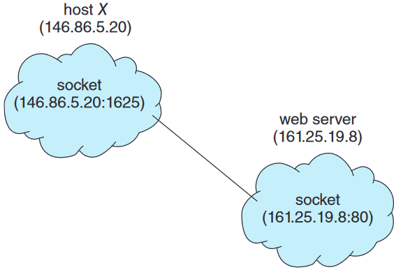
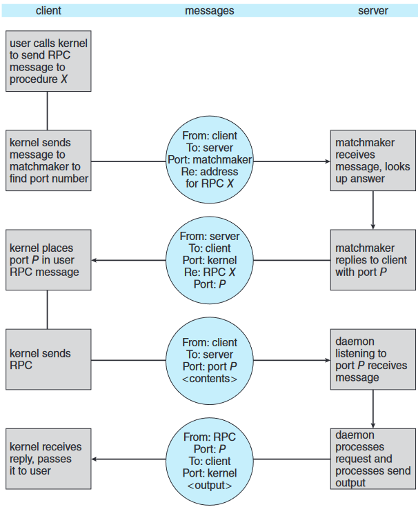

# 운영체제
## 클라이언트-서버 환경에서 통신
클라이언트-서버 환경에서 사용할 수 있는 통신 전략
- 소켓
- 원격 프로시저 호출 (RPCs)

### 소켓
- 소켓: 통신의 endpoint
- 두 프로세스가 네트워크상에서 통신 하려면 양 프로세스마다 하나씩, 총 두개의 소켓 필요
- 각 소켓은 IP주소와 포트 번호로 구별
- 소켓은 클라이언트-서버 구조를 사용<br>
: 서버는 지정된 포트에 클라이언트 요청 메시지가 도착하기를 기다리고, 요청 수신되면 수락해 연결 완성
- 1024 미만 포트는 well-known 포트로 표준 서비스 구현하는 데 사용
<br><br>
- 클라이언트 프로세스가 연결 요청하면 호스트 컴퓨터가 1024보다 큰 임의의 정수를 포트 번호로 부여
- 모든 연결은 유일해야 한다
- 두 호스트 사이 패킷이 오갈 때 패킷들은 지정한 목적지 포트 번호 따라 적절 프로세스로 배달

**예) IP주소 146.86.5.20인 호스트 X에 있는 클라이언트가 IP 주소가 161.25.19.8의 웹 서버에 접속하려 한다**
1. 호스트 X는 클라이언트에 포트 1625를 부여받음 (웹 서버는 80 listen 중)
2. 연결은 두 개의 소켓 호스트 X와 웹 서버로 구성
3. 만약 호스트 X에 있는 다른 클라이언트 프로세스가 동일한 웹 서버와 통신하면 그 클라이언트는 1024보다 크고 1625가 아닌 다른 포트번호 부여받음<br> 
: 모든 연결은 유일한 소켓 쌍으로 구성



**Java로 기술하는 소켓**<br>
세 가지 종류 소켓 제공
- TCP: 연결기반, Socket 클래스로 구현
- UDP: 비연결성, DatagramSocket 클래스 사용
- MulticastSocket: DatagramSocket 클래스의 서브 클래스로, 데이터를 여러 수신자에게 보낼 수 있다

**서버**
```Java
import java.net.*;
import java.io.*;

public class DateServer {
    public static void main(String[] args) {
    	try {
            ServerSocket sock = new ServerSocket(6013);
            
            /* 연결을 위해 listen */
            while (true) {
            	Socket client = sock.accept();
            	PrintWriter pout = new PrintWriter(client.getOutputStream(), true);
            
            	/* 소켓에 date 쓰기 */
            	pout.println(new java.util.Date().toString());
            
            	/* 소켓 닫고 재개 */
            	client.close();
            }
    	} catch (IOException ioe) {
            System.err.println(ioe);
        }
    }
}
```
- 서버는 포트 지정해서 ServerSocket 생성
- `accept()`로 listen 하며 클라이언트가 연결 요청할 때까지 대기하고, 연결 요청 오면 통신에 사용할 수 있는 소켓 생성해 반환
- PrintWriter 객체로 `print()`나 `println()`써서 소켓에 데이터 쓸 수 있게 함

**클라이언트**
```Java
import java.net.*;
import java.io.*;

public class DateClient {
    public static void main(String[] args) {
        try {
          /* 서버 소켓과 연결 생성 */
          Socket sock = new Socket("127.0.0.1",6013);
          
          InputStream in = sock.getInputStream();
          BufferedReader bin = new
          BufferedReader(new InputStreamReader(in));
          
          /* 소켓으로부터 날짜 읽기 */
          String line;
          while ( (line = bin.readLine()) != null) {
              System.out.println(line);
          }
          
          /* 소켓 연결 닫기 */
          sock.close();
      } catch (IOException ioe) {
      	  System.err.println(ioe);
      }
    }
}
```
- 클라이언트는 소켓 생성하고 서버가 listen하는 포트와 연결해 서버와 통신 시작
- 127.0.0.1: loopback 나타내는 IP 주소
<br><br>
- 소켓 통신은 분산된 프로세스 간 널리 사용되고 효율적이나, 수준 낮다<br>
: 구조화되지 않은 바이트 스트림 통신을 해서, 원시적인 바이트 스트림 데이터를 구조화해 해석하는 건 클라이언트와 서버 책임<br>
: 대안으로 높은 수준의 통신 기법인 'RPC' 사용

### 원격 프로시저 호출 (RPC)
+프로시저: 명령어 또는 코드 블록으로, 특정 작업 수행하기위해 정의된 코드<br>
+원격 프로시저: 한 컴퓨터에서 다른 컴퓨터에 위치한 프로시저 호출하는 프로그래밍 패러다임
<br><br>
- 네트워크에 연결된 두 시스템 사이의 통신에 사용하기 위해 프로시저 호출 기법을 추상화하는 방법으로 설계<br>
: 다른 컴퓨터에 있는 프로세스에서 함수를 호출할 수 있는 방식으로 함수 호출 개념 추상화
- 프로세스들이 서로 다른 시스템 위에서 돌아가기 때문에 원격 서비스를 제공하기 위해 메시지 기반 통신함
- 메시지 구조화
- 메시지에는 원격지 포트에서 listen 중인 RPC daemon 주소, 실행되어야 할 함수 식별자, 함수에게 전달될 매개변수가 포함
- 시스템은 네트워크 주소를 하나만 가지지만, 시스템에서 지원되는 여러 서비스를 구별하기 위해 포트를 여러개 가질 수 있다<br>
: 어떤 서비스를 받고자 하면 그 서비스에 대응되는 적절 포트로 메시지 보내야 함
- RPC는 클라이언트가 원격 호스트의 프로시저 호출하는 것을 마치 자기 프로시저 호출하는 것처럼 해줌
<br><br>
- RPC 시스템은 클라이언트에 스텁을 제공해 통신에 필요한 자세한 사항을 숨김 
1. 클라이언트가 원격 프로시저 호출하면 RPC는 대응하는 스텁을 호출하고 원격 프로시저가 필요로 하는 매개변수 건네줌
2. 스텁이 원격 서버의 포트를 찾고 매개변수 정돈함
3. 스텁은 메시지 전달 기법을 사용해 서버에 메시지 전송
4. 서버에도 이에 대응되는 스텁이 존재해 서버 측 스텁이 메시지를 수신한 후 적절한 서버의 프로시저 호출

**매개변수 정돈**
- 클라이언트와 서버 기기의 데이터 표현 방식 차이 문제를 해결하기 위해, RPC 시스템은 기종 중립적인 데이터 표현 방식을 정의함
- 클라이언트는 서버에 데이터 보내기 전 전송할 데이터를 기종 중립적인 형태로 바꾸어 보낸다
- 수신측 기계에서는 중립적 형태의 데이터를 받으면 매개변수를 풀어내면서 자기 기종의 형태로 데이터 바꾼 후 서버에게 넘긴다


**RPC 시스템**
- client와 server간 데이터 중개
- client와 server 사이에 물리적으로 존재하는게 아니라, 클라이언트와 서버 각각 내부의 각 프로세스 내부에서 동작
<br><br>
- 지역 프로시저 호출에 비해, RPC는 네트워크 오류 때문에 실패할 수도 있고 메시지가 중복되어 호출이 여러 번 실행될 수도 있다<br>
-> 문제 해결: 운영체제가 메시지가 "최대 한 번" 실행되는 것이 아니라 "정확히 한 번"은 처리되도록 보장

**최대 한 번**<br>
- 각 메시지에 타임스탬프 기록
- 서버에 보관된 타임스탬프를 가진 메시지가 도착하면 그 메시지는 무시
- 클라이언트는 한 번 이상 메시지를 보낼 수 있고, 메시지에 대한 실행이 단 한 번 발생하는 것 보장

**정확히 한 번**
- 서버가 요청을 받지 못하는 위험 제거
- 서버는 '최대 한 번' 프로토콜 구현하고, 추가로 RPC 요청 수신되었고 실행되었다는 응낙(acknowledgement) 메시지 보내야 함
- 클라이언트는 해당 호출에 대한 ACK을 받을 때까지 주기적으로 각 RPC 호출 재전송

**클라이언트와 서버 간 통신 문제 및 해결 방법**<br>
클라이언트와 서버 포트를 바인딩 해야 하는데, 클라이언트는 서버의 포트 번호를 어떻게 알 수 있나?

1. 고정된 포트 주소로 정해두기
2. 랑데부 방식에 의해 동적 바인딩<br>
: 통신 초기 오버헤드 들지만, 유연함 <br>
2-1. 운영체제는 미리 정해져 있는 고정 RPC 포트를 통해 랑데부용 디먼(matchmaker라 불림) 제공<br>
2-2. 클라이언트가 실행하고싶은 RPC 이름 담고 있는 메시지를 랑데부 디먼에게 보내서 RPC 이름에 대응하는 포트 번호 알려달라고 요청<br>
2-3. 포트 번호가 클라이언트에게 반환되고, 클라이언트는 그 포트 번호로 RPC 요청 계속 보냄<br>



**Android RPC**<br>
Android 운영체제는 바인더 프레임워크를 사용해 동일한 시스템에서 실행되는 프로세스 간 통신의 형태로 RPC를 사용