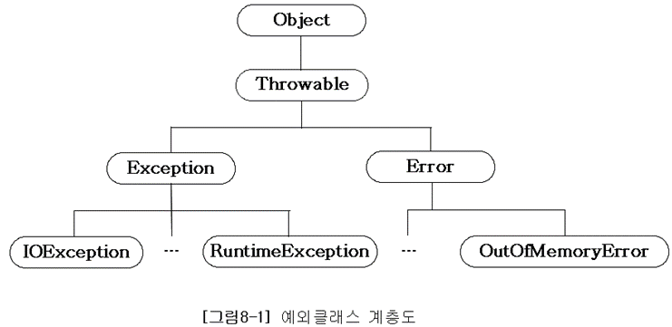
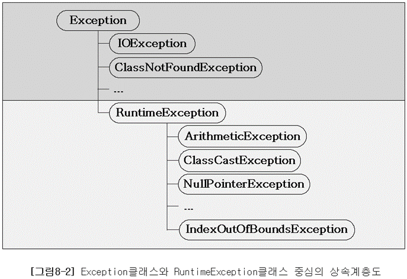

# Java
## 예외처리
### 프로그램 오류
- 프로그램 에러 or 오류: 프로그램 실행 중 오작동 하거나 비정상적으로 종료되는 경우를 초래하는 원인
- 발생시점 따른 구분: 컴파일 에러, 런타임 에러
- 컴파일 에러: 컴파일 시에 발생하는 에러
- 런타임 에러: 프로그램 실행 중 발생하는 에러
- 논리적 에러: 컴파일과 실행은 되지만, 의도와 다르게 동작하는 것<br>
ex) 창고의 재고가 음수, 총에 맞아도 죽지않는 경우
- 소스코드를 컴파일하면 컴파일러가 소스코드에 대해 오타나 잘못된 구문, 자료형 체크 등 기본적인 검사를 수행해 오류가 있는지 알려줌<br>
-> 실행중 발생할 수 있는 잠재적 오류까지 검사할 수 없어서, 런타임 에러 방지 위해 실행중 발생할 수 있는 모든 경우의 수를 고려해 대비해야 한다
- runtime에서 발생할 수 있는 오류 종류: 에러, 예외

**에러(Error)**
- 메모리 부족, 스택오버플로우 등
- 발생하면 복구할 수 없는 심각한 오류
- 프로그램 코드에 의해 수습될 수 없음<br>
: 에러 발생시 비정상적 종료를 막을 길이 없음

**예외(Exception)**
- 발생해도 수습될 수 있는 덜 심각한 것
- 프로그램 코드에 의해 수습될 수 있음<br>
: 이에 대해 적절한 코드를 미리 작성해두면 예외 발생해도 비정상적인 종료를 막을 수 있음

### 예외 클래스의 계층구조
실행 시 발생할 수 있는 오류를 Exception, Error 클래스로 정의했으며, 이는 Object클래스의 자손들


모든 예외의 최고 조상은 Exception 클래스


예외 클래스들은 두 그룹으로 나눌 수 있다
- Exception 클래스와 그 자손들 (RuntimeException과 자손들 제외)
- RuntimeException클래스와 그 자손들 

**RuntimeException 클래스들**
- 프로그래머 실수에 의해 발생하는 예외
- 프로그래밍 요소와 관계 깊다 
- ex) 배열 범위 벗어나기, 값이 null인 참조변수 멤버 호출, 형변환 실패, 정수를 0으로 나누기

**Exception 클래스들**
- 외적 요인에 의해 발생하는 예외
- 사용자 동작에 의해 발생하는 경우 많다
- ex) 존재하지 않는 파일 이름 입력, 입력 데이터 형식이 잘못됨

### 예외처리하기 try-catch문
에러는 어쩔 수 없지만, 예외는 프로그래머가 처리를 미리 해야한다
- 예외처리(exception handling): 프로그램 실행 시 발생할 수 있는 예외에 대비한 코드를 작성하는 것
- 예외처리 목적: 예외 발생으로 인한 프로그램의 비정상 종료를 막고, 정상적인 실행 상태를 유지하는 것

발생한 예외 처리 못하면, 프로그램은 비정상적으로 종료되며 처리되지 못한 예외(uncaught exception)는 JVM의 예외처리기(UncaughtExceptionHandler)가 받아서 예외의 원인을 화면에 출력

예외 처리 위해 try-catch문 사용
```Java
try {
    // 예외 발생할 가능성 있는 문장 작성
} catch (Exception1 e1) {
    // Exception1이 발생했을 때 이를 처리하는 문장
} catch (ExceptionN eN) {
    // ExceptionN이 발생했을 때 이를 처리하는 문장
}
```
- 하나의 try블럭에, 여러 종류 예외 처리할 수 있도록 하나 이상의 catch블럭 올 수 있다
- 이 중 예외 종류와 일치하는 단 한 개의 catch 블럭만 수행됨
- 하나의 메서드 내에 여러 개의 try-catch문 사용 가능
- try 블럭 또는 catch 블럭 안에 또 다른 try-catch문 포함 가능
- catch블럭 괄호 내에 선언된 변수는 catch 블럭 내에서만 유효

**ArithmeticException**
- 산술연산 과정에서 오류있을 때 발생하는 예외
- 정수는 0으로 나누기 금지되어 있어서, 정수를 0으로 나눌 경우 해당 예외 발생
- 실수 연산에서 0으로 나누는 것은 예외 발생 안함 <br>
: 실수는 IEEE 표준따르는데, 0으로 나누는 경우에도 특정 값이나 상태가 정의되어 있음 <br>
ex) 양수/0.0 = 양의 무한대 <br>
ex) 음수/0.0 = 음의 무한대 <br>
ex) 0.0/0.0 = 정의할 수 없는 값(NaN)

### try-catch문에서의 흐름
**try블럭 내에서 예외 발생한 경우**
1. 발생한 예외와 일치하는 catch블럭이 있는지 확인
2. 일치하는 catch블럭 찾으면, 그 catch블럭 내의 문장들을 수행하고 전체 try-catch문을 빠져나가서 그 다음 문장을 계속 수행한다. 만일 일치하는 catch블럭을 찾지 못하면 예외는 처리되지 못한다
- try블럭에서 예외 발생하면, 예외가 발생한 위치 이후에 있는 try블럭의 문장들은 수행되지 않으므로 try블럭에 포함시킬 코드의 범위를 잘 선택해야 한다
```Java
public class ExceptionEx5 {
    public static void main(String[] args) {
        System.out.println(1); // 실행됨
        System.out.println(2); // 실행됨
        try {
            System.out.println(3); // 실행됨
            System.out.println(0/0); // 0으로 나눠서 고의로 ArithmeticException 발생시킴
            System.out.println(4); // 실행되지 않음!!
        } catch (ArithmeticException ae)  {
            System.out.println(5); // 실행됨
        }
        System.out.println(6); // 실행됨
    }
}
```

**try블럭 내에서 예외 발생하지 않은 경우**
1. catch블럭 거치지 않고 전체 try-catch문 빠져나가 수행 계속한다

### 예외의 발생과 catch 블럭
- catch블럭의 괄호()내에는 처리하고자 하는 예외와 같은 타입의 참조변수를 선언해야 함
- 예외 발생시 발생한 예외에 해당하는 클래스의 인스턴스가 만들어짐
- 예외가 발생하면 이 예외를 처리할 수 있는 catch 블럭이 있는지 찾기 위해 첫 번째 catch블럭부터 차례로 내려가면서 catch블럭의 괄호()내에 선언된 참조변수의 종류와 생성된 예외클래스의 인스턴스에 `instanceof` 연산자를 이용해 검사 <br>
-> 검사 결과가 true인 catch블럭 만날 때까지 검사 계속함
- 모든 예외 클래스는 Exception클래스의 자손이라, catch블럭의 괄호()에 Exception클래스 타입의 참조변수를 선언해두면 어떤 종류의 예외가 발생하더라도 이 catch블럭에 의해 처리됨
<br><br>
```Java
public class ExceptionEx7 {
    public static void main(String[] args) {
        System.out.println(1); 
        System.out.println(2); 
        try {
            System.out.println(3); 
            System.out.println(0/0); // 0으로 나눠서 고의로 ArithmeticException 발생
            System.out.println(4); // 실행되지 않음
        } catch (ArithmeticException ae) { //  ArithmeticException은 해당 catch에서만 처리됨
            if (ae instanceof ArithmeticException) {
                System.out.println("true"); // 실행됨
            }
            System.out.println("ArithmeticException"); // 실행됨
        } catch (Exception e) { // ArithmeticException을 제외한 모든 예외가 여기서 처리됨
            System.out.println("Excetion"); // 실행되지 않음
        }
        System.out.println(6); // 실행됨
    }
}
```
- 첫 번째 검사에서 일치하는 catch블럭 찾았기 때문에 두 번째 catch 블럭은 검사하지 않는다
- try블럭 내에서 ArithmeticException이 아닌 다른 종류의 예외가 발생한 경우에는 두 번째 catch블럭인 Exception클래스 타입의 참조변수를 선언한 곳에서 처리되었을 것이다
- try-catch문의 마지막에 Exception클래스 타입의 참조변수를 선언한 catch블럭을 사용하면, 어떤 종류의 예외가 발생해도 이 catch블럭에 의해 처리되도록 할 수 있다

**printStackTrace()와 getMessage()**
- 예외가 발생했을 때 생성되는 예외 클래스의 인스턴스에는 발생한 예외에 대한 정보가 담겨있다 <br>
: printStackTrace()와 getMessage()를 통해 정보 얻을 수 있다 <br>
: catch블럭 괄호()에 선언된 참조변수를 통해 이 인스턴스에 접근 가능

- `printStackTrace()`: 예외발생 당시 call stack에 있었던 메서드의 정보와 예외 메시지 화면에 출력
- `getMessage()`: 발생한 예외 클래스의 인스턴스에 저장된 메시지 얻는다

예제 코드
```Java
public class ExceptionEx8 {
    public static void main(String[] args) {
        System.out.println(1);
        System.out.println(2);
        try {
            System.out.println(3);
            System.out.println(0/0); // 예외발생! (9 line)
            System.out.println(4); // 실행되지 않음
        } catch (ArithmeticException ae) {
            ae.printStackTrace();
            System.out.println("예외메시지 : " + ae.getMessage());
        }
        System.out.println(6); // 실행됨
    }
}
```

결과
```
1
2
3
예외메시지 : / by zero
6
java.lang.ArithmeticException: / by zero
	at Example.ExceptionEx8.main(ExceptionEx8.java:9)

Process finished with exit code 0
```
- 결과는 예외가 발생해 비정상적으로 종료되었을 때와 비슷하지만, 예외는 try-catch문에 처리되어 프로그램은 정상적으로 종료<br>
: 예외처리를 통해 예외가 발생해도 비정상적으로 종료하지 않도록 하는 동시에, 함수를 통해 예외 발생 원인을 알 수 있다

**멀티 catch블럭**
- 여러 catch블럭을 `|`기호를 이용해 하나의 catch블럭으로 합칠 수 있다
- 코드 중복 줄인다
- `|`기호로 연결할 수 있는 예외 클래스 개수는 제한 없음
- `|`은 논리 연산자가 아니라 기호

멀티 catch 블럭 적용 전
```Java
try {
} catch (ExceptionA e) {
    e.printStackTrace();
} catch (ExceptionB e2) {
    e2.printStackTrace();
}
```

멀티 catch 블럭 적용 후
```Java
try {
} catch (ExceptionA | ExceptionB e) {
    e.printStackTrace();
} 
```

- `|` 기호로 연결된 예외 클래스가 조상과 자손 관계면 컴파일 에러 발생 <br>
: 조상클래스만 쓰는 것과 동일해서 불필요한 코드 제거하라는 의미
- 멀티 catch는 하나의 catch블럭으로 예외 처리하는거라 멀티 catch블럭 내에서 실제로 어떤 예외가 발생한지 알 수 없기 때문에, 멀티 catch문의 공통 분모인 조상 예외 클래스에 선언된 멤버만 사용 가능
- `instanceof`로 어떤 예외인지 확인하면, 특정 예외 클래스의 함수를 사용해 개별처리할 수 있음

```Java
try {
} catch (ExceptionA | ExceptionB e) {
    e.methodA(); // 에러. 특정 클래스인 ExceptionA에 선언된 함수 호출 불가

    if (e instanceof ExceptionA) {
        ExceptionA e1 = (ExceptionA)e;
        e1.methodA(); // OK. ExceptionA에 선언된 메서드 호출 가능
    } 
    e.printStackTrace();
}
```

### 예외 발생시키기
`throw` 사용해 프로그래머가 고의로 예외 발생시킬 수 있다

1. `new`연산자로 발생시키려는 예외 클래스 객체 만든다 <br>
: `Exception e = new Exception("고의로 발생");`
2. `throw` 키워드로 예외 발생시킨다 <br>
: `throw e;`

+한 번에 처리: `throw new Exception("고의로 발생");`

예제 코드 1
```Java
public class ExceptionEx9 {
    public static void main(String[] args) {
        try {
            Exception e = new Exception("고의로 발생");
            throw e;
//            throw new Exception("고의로 발생"); // 위의 두 줄을 한 줄로 쓸 수 있다
        } catch (Exception e) {
            System.out.println("에러 메시지: " + e.getMessage());
            e.printStackTrace();
        }
        System.out.println("프로그램 정상 종료되었음");
    }
}
```

결과 1
```
에러 메시지: 고의로 발생
프로그램 정상 종료되었음
java.lang.Exception: 고의로 발생
	at Example.ExceptionEx9.main(ExceptionEx9.java:6)

Process finished with exit code 0
```

- 예외 인스턴스 생성자에 String넣으면, 그 값이 예외 인스턴스에 메시지로 저장됨<br>
: `getMessage()`로 얻을 수 있다

예제 코드 2
```Java
public class ExceptionEx10 {
    public static void main(String[] args) {
        throw new Exception(); // Exception 고의로 발생 -> 컴파일시 에러 발생: 예외처리가 되어야 할 부분에 예외처리가 되어 있지 않다는 에러 
    }
}
```
- Exception클래스들이 발생할 가능성이 있는 문장에 대해 예외처리 하지 않으면 컴파일조차 안됨

예제 코드 3
```Java
public class ExceptionEx11 {
    public static void main(String[] args) {
        throw new RuntimeException(); // RuntimeException 고의로 발생. 컴파일 성공적으로 됨. 그러나 실행시 RuntimeException발생해 비정상적 종료 
    }
}
```
- RuntimeException클래스와 그 자손에 해당하는 예외는 프로그래머에 의해 실수로 발생하는 것이기 때문에 예외처리를 강제하지 않는다 

**unchecked 예외**
- 컴파일러가 예외 처리를 확인하지 않는 RuntimeException클래스들

**checked 예외**
- 예외처리 확인하는 Exception클래스들