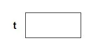
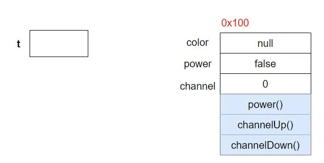
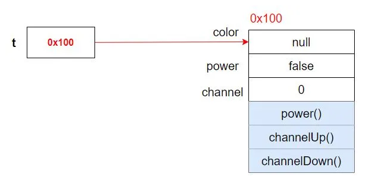
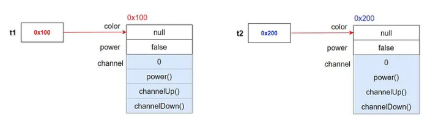
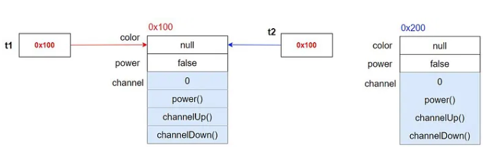
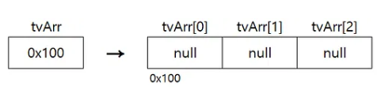

# Java
## 객체지향언어
### 객체지향언어의 역사
초창기의 컴퓨터는 모의실험을 목적으로 사용<br>
모의실험을 위해 실제 세계와 유사한 가상 세계를 컴퓨터 속에 구현하고자 노력<br>
-> 객체지향 탄생

- 객체지향이론 기본 개념: 실제 세계는 사물(객체)로 이루어져 있고, 발생하는 모든 사건들은 사물간의 상호작용이다
- 실제 사물의 속성과 기능을 변수(데이터)와 함수로 정의해 가상세계 구현<br>
-> 가상세계에서 모의실험해 시간과 비용 절약 

전에는 절차적 언어들이 주류를 이루었는데, 프로그램 규모가 커지고 사용자 요구가 빠르게 변화하며 한계를 느껴 객체지향언어가 대안으로 떠오름 <br>
-> 절차지향에서 규모 커지면, 코드 구조 복잡해지면서 중복 코드 작성 위험 증가 <br>
-> 절차지향에서 사용자 요구가 빠르게 변화하면, 디버깅과 유지보수 어려움 <br>

- 절차지향: 데이터 중심 함수 구현
- 객체지향: 기능 중심 함수 구현

### 객체지향언어
**특징**
- 코드 재사용성이 높다
- 코드 관리 용이<br>
: 코드간 관계 이용해 적은 노력으로 쉽게 코드를 변경할 수 있다
- 신뢰성이 높은 프로그래밍 가능 <br>
: 제어자와 메서드 이용해 데이터 보호하고, 코드 중복 제거해 코드 불일치로 인한 오동작 방지

객체지향 프로그래밍은 프로그래머에게 거시적 관점에서 설계할 수 있는 능력 요구

## 클래스와 객체
### 클래스와 객체의 정의와 용도
- 클래스: 객체를 정의해놓은 것, 객체의 설계도 또는 틀
- 클래스 용도: 객체 생성

**객체**
- 실제로 존재하는 것
- 객체지향이론에서 객체: 사물과 같은 유형의 객체 + 개념이나 논리같은 무형의 객체
- 프로그래밍에서 객체: 클래스에 정의된 내용대로 메모리에 생성된 것

클래스는 단지 객체 생성에 사용될 뿐, 객체 그 자체는 아니다 <br>
객체 사용을 위해서는 먼저 클래스로부터 객체를 생성해야한다<br>
ex) TV를 보기위해서는, TV설계도를 통해 TV가 만들어진 후에야 TV를 사용할 수 있다 <br>
-> 객체 사용한다는 건 객체가 가지고 있는 속성과 기능을 사용한다는 뜻
<br><br>
클래스를 정의하고 클래스를 통해 객체 생성하는 이유: 하나의 설계도만 잘 만들어두면 제품을 만드는 일이 쉬워지기 때문

### 객체와 인스턴스 
- 클래스의 인스턴스화: 클래스로부터 객체 만드는 과정
- 인스턴스: 클래스로부터 만들어진 객체<br>
-> 어떤 클래스로부터 만들어진 것인지 강조하는 구체적인 의미
- 객체: 모든 인스턴스를 대표하는 포괄적인 의미

### 객체의 구성요소 - 속성과 기능
객체는 속성과 기능의 집합<br>
객체가 가지고 있는 속성과 기능을 그 객체의 멤버라고 한다<br>
클래스로부터 객체를 생성하면, 클래스에 정의된 속성과 기능을 가진 객체가 만들어지는 것이다<br>

- '속성'과 같은 뜻의 용어: 멤버변수, 특성, 필드, 상태
- '기능'과 같은 뜻의 용어: 메서드, 함수, 행위

### 인스턴스의 생성과 사용
**인스턴스 생성**
```Java
클래스명 변수명; // 클래스의 객체를 참조하기 위한 참조변수 선언
변수명 = new 클래스명(); // 클래스 객체 생성 후, 객체 주소를 참조변수에 저장

Tv t;
t = new Tv();
```

**`Tv t`**<br>
Tv클래스 타입의 참조변수 t 선언 <br>
메모리에 참조변수 t를 위한 공간 마련된다<br>
아직 인스턴스 생성되지 않아 참조변수로 아무것도 할 수 없다<br>



**`t = new Tv();`** <br>
연산자 new로 Tv클래스 인스턴스가 메모리의 빈 공간에 생성된다 (주소 0x100에 생성되었다고 가정) <br>
멤버변수는 각 자료형에 해당하는 기본값으로 초기화된다 <br>
 <br>
대입연산자에 의해 생성된 객체의 주소값이 참조변수 t에 저장된다 <br>
이제 참조변수 t로 Tv인스턴스에 접근할 수 있다<br>


- 인스턴스 다루기 위해서는 참조변수가 반드시 필요하다
- 인스턴스는 오직 참조변수를 통해서만 다룰 수 있다
- 참조변수 타입은 인스턴스 타입과 일치해야한다
<br><br>
- 인스턴스의 멤버변수 사용: `참조변수.멤버변수`
<br><br>
- 같은 클래스로부터 생성되었을지라도 각 인스턴스 속성은 서로 다른 값을 유지할 수 있고, 메서드 내용은 모든 인스턴스에 대해 동일하다

**참조변수에는 하나의 값(주소)만 저장될 수 있다**
```Java
Tv t1 = new Tv();
Tv t2 = new Tv();

t2 = t1; // t1이 저장하고 있는 값(주소)을 t2에 저장

t1.channel = 7; // t2.channel 값도 변경된다
```
<br>
`t2 = t1;`<br>
<br>
t1, t2모두 같은 Tv클래스의 인스턴스를 가리킨다<br>
t2가 원래 참조하고 있던 인스턴스는 더 이상 사용할 수 없게 된다

- 자신을 참조하고 있는 참조변수가 하나도 없는 인스턴스는 더 이상 사용되어질 수 없으므로 '가비지 컬렉터'에 의해 자동으로 메모리에서 제거된다

### 객체 배열
- 객체를 배열로 다루는 것
- 객체 배열 안에 객체가 저장되는 것이 아니고, 객체의 주소가 저장된다
- 참조변수들을 하나로 묶은 참조변수 배열인 것
- 배열 생성시, 각 요소는 참조변수의 기본값인 null로 자동 초기화

`Tv[] tvArr = new Tv[3];` : 길이가 3인 Tv타입의 참조변수 배열 
 <br>
객체 배열 생성하는 것은 객체를 다루기 위한 참조 변수들이 만들어진 것일 뿐, 아직 객체가 저장되지 않았다 <br>
객체를 생성해서 객체 배열의 각 요소에 저장해야 한다

```Java
tvArr[0] = new Tv();
tvArr[1] = new Tv();
tvArr[2] = new Tv();
```

```Java
Tv[] tvArr = {new Tv(), new Tv(), new Tv()};
```

```Java
for (int i = 0; i < tvArr.length; i++) {
    tvArr[i] = new Tv();
}
```

객체배열에 같은 타입의 객체만 저장 가능